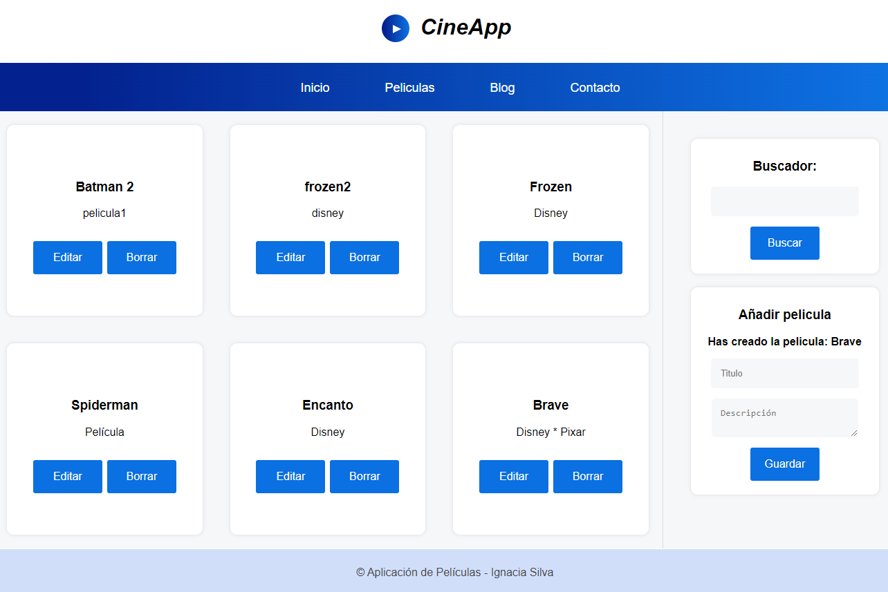

# Sitio para administrar Películas con React

## Índice

* [1. Descripción del Proyecto](#1-descripcion-del-proyecto)
* [2. Características](#2-caracteristicas)
* [3. Tecnologías usadas](#3-tecnologias-usadas)
* [4. Instrucciones de uso](#4-instrucciones-de-uso)
* [5. Contribuciones](#5-contribuciones)
* [6. Contacto ](#6-contacto)

## 1. Descripción del Proyecto

Este proyecto es una aplicación web desarrollada en React que te permite crear, editar, eliminar y buscar películas. Puedes crear una película proporcionando su nombre y descripción, y una vez creada, tendrás la opción de editar o eliminar la película según tus necesidades. Además, se incluye una funcionalidad de búsqueda que te permite filtrar películas por su nombre. 

## 2. Características

* Crear Película: Agrega una nueva película proporcionando su nombre y descripción.
* Editar Película: Modifica el nombre y la descripción de una película existente.
* Eliminar Película: Elimina una película de la lista.
* Búsqueda por Nombre: Utiliza el buscador para filtrar películas por su nombre. 

## 3. Tecnologías usadas
* React: La interfaz de usuario está construida utilizando la biblioteca React, lo que permite crear componentes reutilizables y una experiencia de usuario fluida.

* State Management: Se utiliza el estado local de React para gestionar la información de las películas y sus detalles.

* Routing: El enrutamiento está implementado para permitir la navegación entre diferentes vistas de la aplicación.

* LocalStorage: La información sobre las películas se almacena en el almacenamiento local del navegador para persistencia de datos.

* Estilos: Los estilos y el diseño de la aplicación se manejan mediante CSS.

* Gestión de formularios: Se utilizan formularios para la entrada de datos al crear o editar películas.

## 4. Instrucciones de uso

1. Clona este repositorio.
2. Abre una terminal y navega hasta el directorio del proyecto.
3. Ejecuta npm install para instalar las dependencias.
4. Ejecuta npm start para iniciar la aplicación en tu navegador.
5. Interactúa con la aplicación para crear, editar, eliminar y buscar películas.

## 5. Contribuciones

¡Las contribuciones son bienvenidas! Si deseas contribuir a este proyecto, sigue estos pasos:

1. Realiza un fork de este repositorio.
2. Crea una rama con una descripción clara de la función que estás implementando.
3. Desarrolla y prueba tu función.
4. Realiza un pull request describiendo tus cambios.

Como tip: Se pueden agregar funciones a los items del menú

## 6. Contacto

- [x] Si tienes alguna pregunta o sugerencia, no dudes en ponerte en contacto conmigo! [Aquí](https://www.linkedin.com/in/mariaignaciasilva/)

¡Que disfrutes utilizando esta aplicación para administrar tus películas de manera fácil y conveniente!